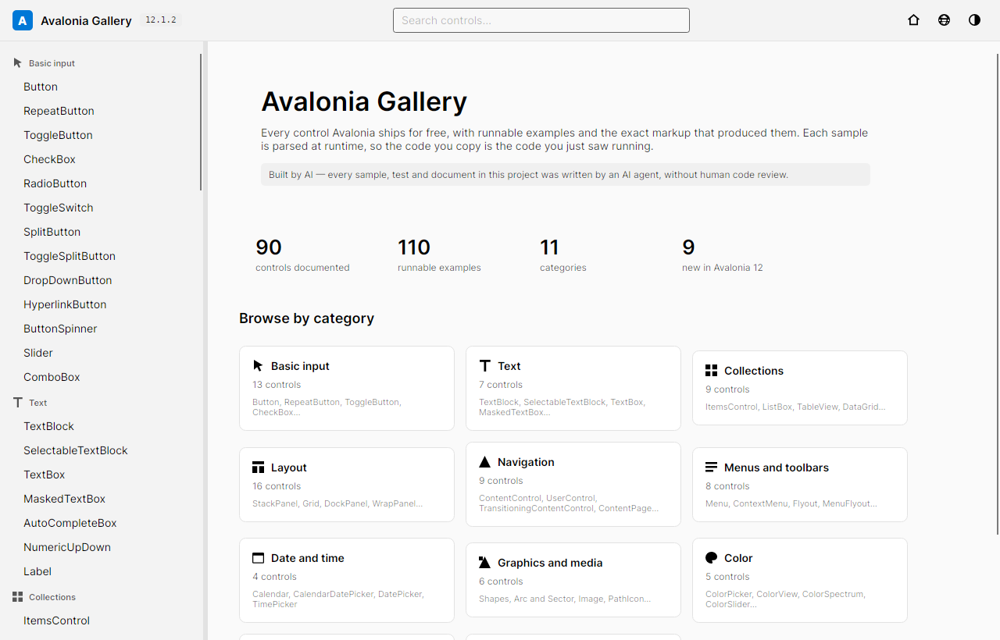
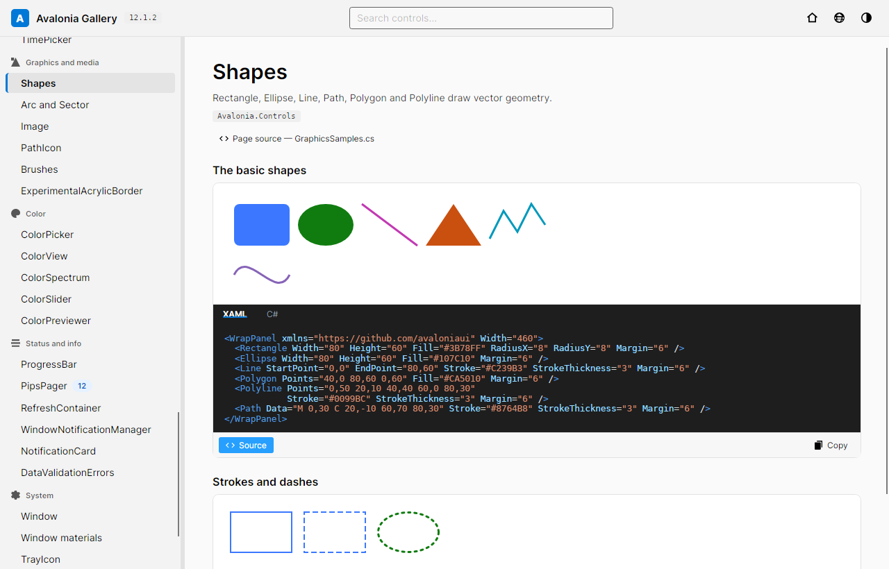

# Avalonia 控件库

*[English](README.md)*

仿 WinUI 3 Gallery 风格的控件浏览器，收录 Avalonia 免费开源提供的全部控件。
Avalonia 12.1.2、.NET 10，桌面端（Windows / macOS / Linux）。

每个示例都是运行时解析的 XAML，所以你复制到的源码，就是渲染出旁边那个控件的源码。
每个示例另附 C# 标签页。

> **本项目由 AI 实现。** 仓库中的全部代码、示例、测试与文档均由 AI 代理编写，未经过人工代码评审。





## 构建

需要 **.NET 10 SDK**。必须是 10：Avalonia 12 的源生成器针对 Roslyn 4.14 编译，在 .NET 8 SDK 上
会静默加载失败，构建随后以一大片 `CS0103` 告终，而不会给出有用的报错。

```bash
dotnet run --project src/AvaloniaGallery.Desktop   # 运行
dotnet build                                       # 构建全部
dotnet test                                        # 522 个测试
```

无需附加参数：根目录只有一个解决方案文件。

`.github/workflows/release.yml` 接收版本号，为 `win-x64`、`win-arm64`、`osx-x64`、`osx-arm64`、
`linux-x64`、`linux-arm64` 发布自包含单文件产物；macOS 输出带图标的 `.app` bundle。

## 收录控件

11 个分类、90 个控件、110 个可运行示例。

**基础输入**（13）
Button · RepeatButton · ToggleButton · CheckBox · RadioButton · ToggleSwitch · SplitButton ·
ToggleSplitButton · DropDownButton · HyperlinkButton · ButtonSpinner · Slider · ComboBox

**文本**（7）
TextBlock · SelectableTextBlock · TextBox · MaskedTextBox · AutoCompleteBox · NumericUpDown · Label

**集合**（9）
ItemsControl · ListBox · TableView · DataGrid · TreeView · TabControl · TabStrip · Carousel ·
VirtualizingStackPanel

**布局**（16）
StackPanel · Grid · DockPanel · WrapPanel · UniformGrid · Canvas · RelativePanel · Border ·
ScrollViewer · Viewbox · GroupBox · Expander · SplitView · GridSplitter · LayoutTransformControl ·
ThemeVariantScope

**导航**（9）
ContentControl · UserControl · TransitioningContentControl · ContentPage · NavigationPage ·
TabbedPage · DrawerPage · CarouselPage · Popup

**菜单与工具栏**（8）
Menu · ContextMenu · Flyout · MenuFlyout · CommandBar · ToolTip · Separator · NativeMenuBar

**日期与时间**（4）
Calendar · CalendarDatePicker · DatePicker · TimePicker

**图形与媒体**（6）
Shapes · Arc and Sector · Image · PathIcon · Brushes · ExperimentalAcrylicBorder

**颜色**（5）
ColorPicker · ColorView · ColorSpectrum · ColorSlider · ColorPreviewer

**状态与信息**（6）
ProgressBar · PipsPager · RefreshContainer · WindowNotificationManager · NotificationCard ·
DataValidationErrors

**系统**（7）
Window · Window materials · TrayIcon · NativeControlHost · ManagedFileChooser ·
AboutAvaloniaDialog · OpenGlControlBase

**Avalonia 12 新增：** TableView · GroupBox · ContentPage · NavigationPage · TabbedPage ·
DrawerPage · CarouselPage · CommandBar · PipsPager

桌面端专属页面（TrayIcon、Window materials、NativeMenuBar）会注册真实的托盘图标，并把真正的
Mica / Acrylic / 模糊应用到当前窗口，同时如实显示平台实际授予的效果级别，而不是假装成功。

## 未收录

约 50 个抽象基类、呈现器与图层（`TemplatedControl`、`ContentPresenter`、`OverlayLayer` 等）——
它们属于基础设施，而不是你会摆到界面上的控件。

`TreeDataGrid` 未收录：原版仍是 MIT，但活跃开发已迁往 Accelerate 下的商业分支，而 `TableView`
才是 12.x 中面向表格数据的开源答案。

此处展示的一切均为 MIT 许可，可免费商用。用作应用图标的 Avalonia logo 版权归 Avalonia 项目所有。
